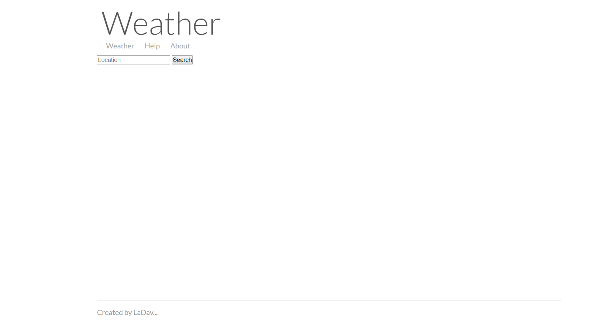

# Weatherly
Weatherly is a weather forecast web API developed using Node JS and currently deployed on Heroku cloud. 
To use weatherly all you need to do is, provide a location and weatherly will return the current weather conditions, an hour-by-hour forecast for the next 48 hours, and a day-by-day forecast for the next week.

#### `Usage`
`https://ladav-weatherly.herokuapp.com/weather?address=[location]` 
Example- https://ladav-weatherly.herokuapp.com/weather?address=delhi

## API Request Types

#### `Forecast Request`

A Forecast Request returns the current weather conditions, an hour-by-hour forecast for the next 48 hours, and a day-by-day forecast for the next week.

##### Example Request

`https://ladav-weatherly.herokuapp.com/weather?address=[location]&unit=[unit]`
      
      `{
          "location": "Delhi, India",
          "latitude": 28.66667,
          "longitude": 77.21667,
          "timezone": "Asia/Kolkata",
          "currently": {
              "time": 1585201823,
              "summary": "Overcast",
              "icon": "cloudy",
              "precipIntensity": 0,
              "precipProbability": 0,
              "temperature": 30.04,
              "apparentTemperature": 30.04,
              "dewPoint": 10.87,
              "humidity": 0.31,
              "pressure": 1012.5,
              "windSpeed": 2.88,
              "windGust": 4.9,
              "windBearing": 298,
              "cloudCover": 0.94,
              "uvIndex": 5,
              "visibility": 16.093,
              "ozone": 293.8
          },
          "hourly": {
              "summary": "Rain starting tomorrow morning.",
              "icon": "rain",
              "data": [{
                 "time": 1585200600,
                 "summary": "Overcast",
                 "icon": "cloudy",
                 "precipIntensity": 0,
                 "precipProbability": 0,
                 "temperature": 29.1,
                 "apparentTemperature": 29.1,
                 "dewPoint": 11.21,
                 "humidity": 0.33,
                 "pressure": 1012.8,
                 "windSpeed": 2.8,
                 "windGust": 4.73,
                 "windBearing": 300,
                 "cloudCover": 0.94,
                 "uvIndex": 5,
                 "visibility": 16.093,
                 "ozone": 293.3
             },
               ...
             ]
          },
         "daily": {
            "summary": "Rain tomorrow.",
            "icon": "rain",
            "data": [{
               "time": 1585161000,
               "summary": "Overcast throughout the day.",
               "icon": "cloudy",
               "sunriseTime": 1585183740,
               "sunsetTime": 1585228020,
               "moonPhase": 0.07,
               "precipIntensity": 0.0447,
               "precipIntensityMax": 0.6822,
               "precipIntensityMaxTime": 1585224000,
               "precipProbability": 0.12,
               "precipType": "rain",
               "temperatureHigh": 31.58,
               "temperatureHighTime": 1585213380,
               "temperatureLow": 22.21,
               "temperatureLowTime": 1585276200,
               "apparentTemperatureHigh": 31.3,
               "apparentTemperatureHighTime": 1585213380,
               "apparentTemperatureLow": 22.48,
               "apparentTemperatureLowTime": 1585276200,
               "dewPoint": 10.93,
               "humidity": 0.39,
               "pressure": 1011.5,
               "windSpeed": 2.86,
               "windGust": 9.66,
               "windGustTime": 1585231080,
               "windBearing": 306,
               "cloudCover": 0.93,
               "uvIndex": 5,
               "uvIndexTime": 1585205520,
               "visibility": 16.093,
               "ozone": 291.7,
               "temperatureMin": 22.43,
               "temperatureMinTime": 1585176960,
               "temperatureMax": 31.58,
               "temperatureMaxTime": 1585213380,
               "apparentTemperatureMin": 22.7,
               "apparentTemperatureMinTime": 1585176960,
               "apparentTemperatureMax": 31.3,
               "apparentTemperatureMaxTime": 1585213380
            },
            ...
            ]
          }
       }`
          
          
## Request Parameters
`https://ladav-weatherly.herokuapp.com/weather?address=[location]&unit=[unit]&exclude=[currently,hourly,daily]`

#### `location=[location]`
Return weather condition for the best match of passed location.

#### `units=[units]` optional
Return weather conditions in the requested units. [units] should be one of the following:
* `auto`: automatically select units based on geographic location
* `ca`: same as si, except that windSpeed and windGust are in kilometers per hour
* `uk2`: same as si, except that nearestStormDistance and visibility are in miles, and windSpeed and windGust in miles per hour
* `us`: Imperial units / Fahrenheit
* `si`: SI units / Celsius (the default)

#### `exclude=[blocks]` optional
Exclude some number of data blocks from the API response. This is useful for reducing latency and saving cache space. The value blocks should be a comma-delimeted list (without spaces) of any of the following:

* `currently`
* `hourly`
* `daily`
* `alerts`
* `flags`

#### `icon` optional
A text summary of this data point, suitable for selecting an icon for display. 
Can have the following values:
`clear-day`, `clear-night`, `rain`, `snow`, `sleet`, `wind`, `fog`, `cloudy`, `partly-cloudy-day`, `partly-cloudy-night`

## To Use The Project

#### `Prerequisite`
  * get node JS- [Node JS](https://nodejs.org/en/)
  * After that download or clone the project, run `npm install` in the project directory to download the application dependencies.

In the project directory, you can run:

#### `npm run dev`

Runs the app in the development mode. 
Open [http://localhost:3000](http://localhost:3000) to view it in the browser.

The page will reload if you make edits. 
You will also see any lint errors in the console.

#### `npm run start`

It is for the Server use. Weatherly is currently deployed on [heroku](https://www.heroku.com/) cloud.

## UI

